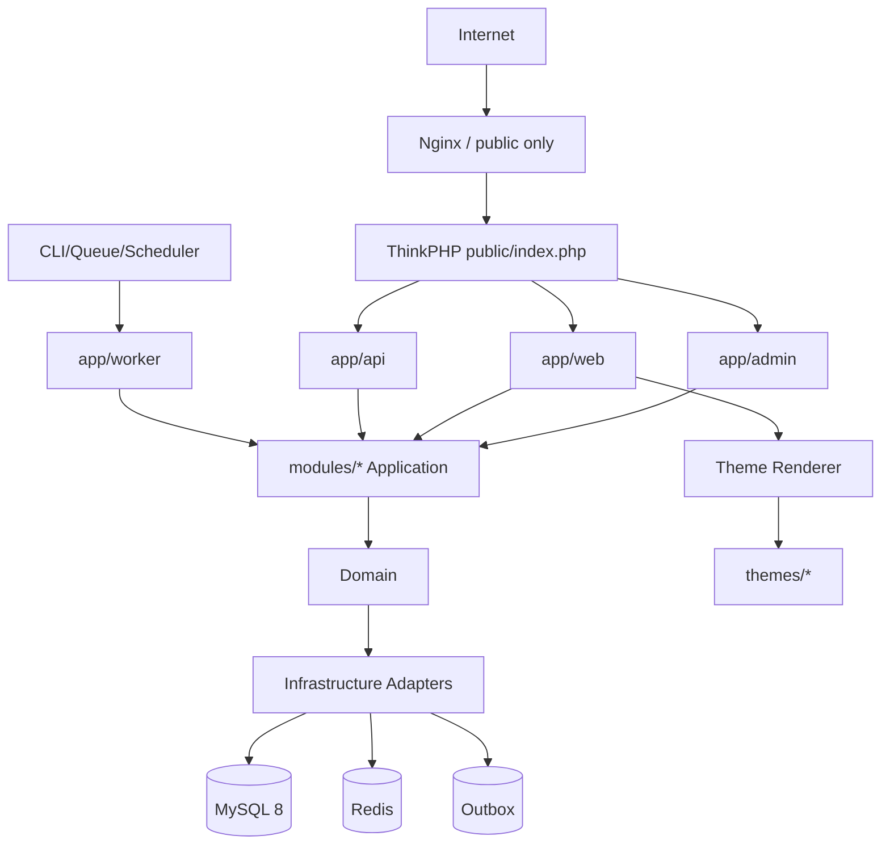

# 总体目标架构

## 依赖方向
`HTTP/Worker -> Application -> Domain <- Infrastructure`。
Domain 不反向依赖入口或框架。

## 入口映射
- `/admin/*` → admin
- `/`、站点域名 → web
- `/api/v1/*` → api/public
- `/api/webhook/*` → api/webhook
- `/api/open/*` → api/open
- worker/common 无 HTTP。
