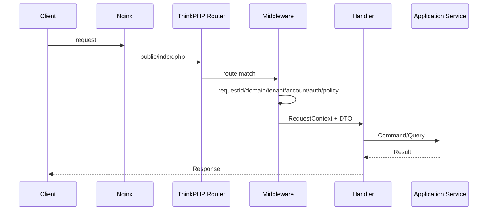

# RequestContext 与路由

旧 `$_W` 拆为不可变上下文：

```text
RequestContext
- requestId
- traceId
- runtimeType
- tenantId?
- accountId?
- siteId?
- principal?
- locale
- clientIp
```

旧 `$_GPC` 改为 Request DTO + Validator。


