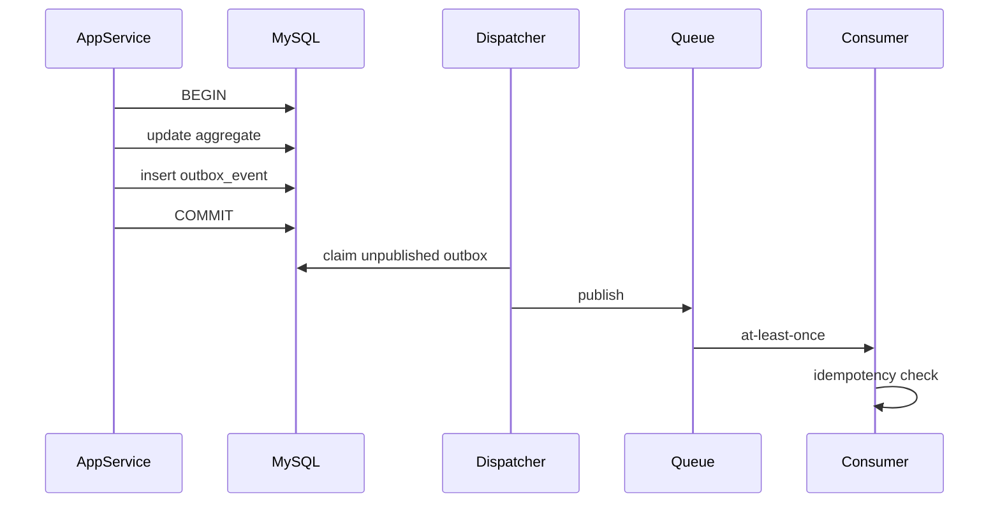

# 数据与事务

## 规则
- 新核心只用 InnoDB。
- Domain Entity != ThinkORM Model。
- Repository Interface 在 Domain/Application，ThinkORM 实现在 Infrastructure。
- Application Service 决定事务边界。

## 断线重连
- 非事务 SELECT：允许有限重连重试。
- 非事务写：仅在幂等/可确认结果时重试。
- 事务内连接丢失：立即失败，禁止新连接继续原事务；必要时从 Application Transaction 入口整体重试。

## Outbox

