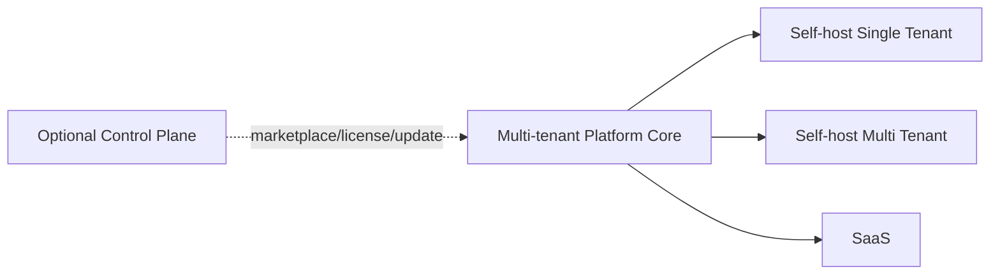

# SaaS 与 Self-host

同一代码、同一领域模型，不做两套业务实现。

```text
DeploymentMode
├── SELF_HOST_SINGLE_TENANT
├── SELF_HOST_MULTI_TENANT
└── SAAS
```

差异主要是运营策略：Tenant 数量限制、Billing/Plan/Marketplace/Reseller 是否启用、Control Plane 是否连接。



Control Plane 与 SaaS Runtime 解耦；断开 Control Plane 后 Self-host 核心业务仍可运行。
