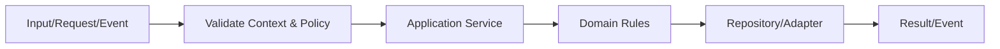
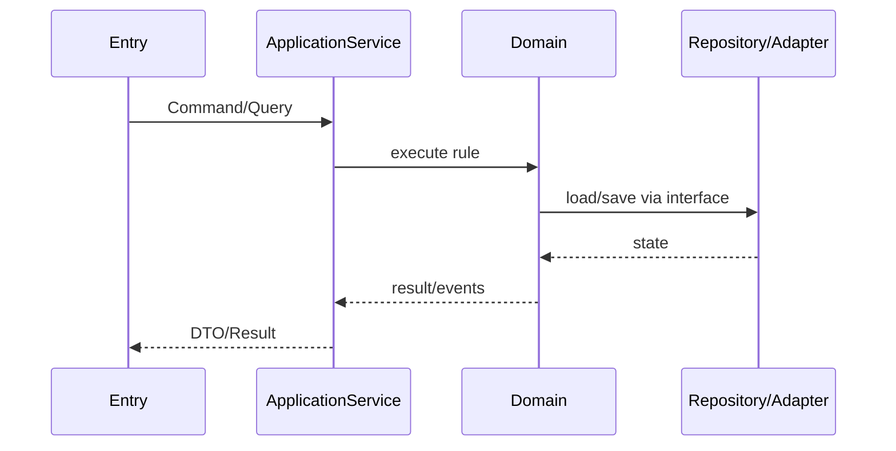

# ST-10-03 — SaaS Mode

所属：EPIC-10 Deployment & Operations

## User Story
作为平台/租户相关角色，我希望系统提供“SaaS Mode”，以在保持 WeEngine 核心业务结果兼容的同时获得更清晰、可测试的实现。

## AS-IS
迁移团队必须先通过 R20 源码、Golden Master 或数据库样本确认旧行为；任何未验证的历史行为不得凭函数名猜测。

## TO-BE
Controller/Worker 仅做入口适配，核心规则放在对应 Module Application/Domain；基础设施通过接口注入。

### 关键业务规则
SaaS 与 Self-host 共用同一多租户核心。SaaS 只是在运营策略上启用多 Tenant、Plan/Billing/Marketplace/Quota/Reseller，不维护第二套业务代码。

## 主流程

## 时序

## Acceptance Criteria
- AC1：主业务结果与明确标记为 MUST_COMPAT 的旧行为一致。
- AC2：Tenant/Account/User 边界无隐式跨域访问。
- AC3：失败路径返回稳定错误码，不依赖 PHP warning/notice。
- AC4：关键写操作有事务、幂等或唯一约束。
- AC5：审计记录包含 actor/tenant/account/action/result/request_id。

## Task
1. 建立 Domain model/interface。
2. 实现 Application Service。
3. 实现 ThinkPHP Infrastructure Adapter。
4. 接入 admin/web/api/worker 中需要的入口。
5. 编写迁移和回滚脚本。
6. 编写测试与监控。

## Test
- Unit：领域规则。
- Component：Application + fake repository。
- Integration：MySQL/Redis/Queue。
- Contract：入口/API/事件契约。
- Golden Master：与 R20 样本行为比对。
- E2E：关键用户旅程。

## Quality Gate
所有 AC 自动化可验证；高风险 Story 必须包含故障注入、权限负向用例、跨租户测试。
